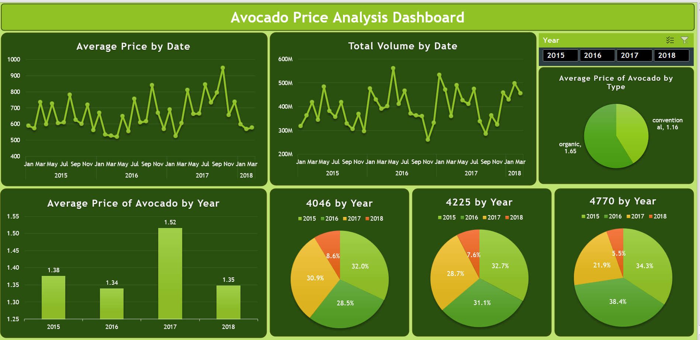

# Avocado Sales Analysis Dashboard

## Overview

The Avocado Sales Analysis Dashboard provides a comprehensive view of avocado sales trends, pricing dynamics, and consumer preferences based on a dataset sourced from Kaggle. The analysis is conducted using Excel, involving data cleaning, and utilizing pivot tables for in-depth insights. Here's a summary of the key findings:

## Key Insights

1. **Average Price Trends:**
   - The AveragePrice of avocados exhibits a seasonal pattern, starting just below 1.2 and peaking above 1.8 during specific months, notably December/January. Conversely, a drop in AveragePrice is observed in the months of September - November.

2. **Avocado Types:**
   - Conventional avocados (Type 0) dominate the market, surpassing Organic avocados (Type 1) by a significant margin. The AveragePrice for Conventional avocados hovers just below 1.2, while for Organic avocados, it rises above 1.6.

3. **Law of Supply & Demand:**
   - Observations of the AveragePrice dynamics in relation to Total Volume and Total Bags indicate adherence to the Law of Supply & Demand. A correlation between price, volume, and demand is evident.

4. **Total Volume Trends:**
   - A clear rising trend in Total Volume of avocados is observed from 2015. The preference for Conventional avocados (Type 0) is suggested by the assumption that customers favor them due to their lower AveragePrice compared to Organic avocados (Type 1).

5. **PLU Code Preferences:**
   - Preferences for avocados based on PLU codes 4046, 4225, and 4770 vary across years. Notable observations include the order of preference in 2015 and a shift in 2016 and 2017.

6. **Bags and Total Volume Relationship:**
   - The Law of Cause and Effect is apparent in the relationship between Total Volume and the usage of bags for avocados. As Total Volume increases, there is a corresponding increase in the utilization of bags.

## Dashboard Creation Process

The dashboard was created through a series of steps, including data cleaning and analysis using Excel. Pivot tables were employed to derive meaningful insights, and the visualizations were designed to convey the key findings effectively.

For a more detailed exploration, please refer to the Excel files and visualizations in the repository.
