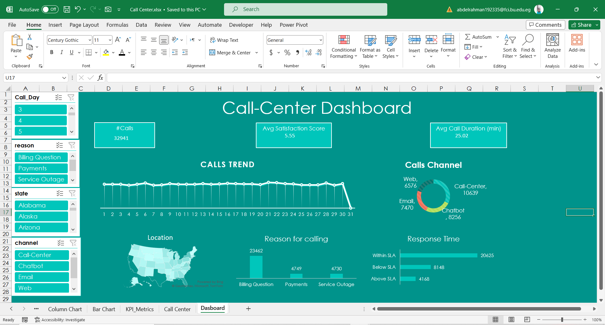

# Call Center Excel Dashboard

## Overview

The Call Center Excel Dashboard is a powerful tool for visualizing and analyzing call center data from October 2020. This interactive dashboard provides essential insights and KPIs to monitor performance and understand customer interactions.

## Key Features

### 1. KPIs
- **Total Calls:** Displays the total number of calls made during October 2020.
- **Average Customer Satisfaction Score:** Presents the average satisfaction score of customers.
- **Average Call Duration:** Shows the average duration of calls in minutes.

### 2. Trend of Calls (Line Chart)
- Visualizes the trend of calls throughout the month of October.

### 3. Call Channels (Doughnut Chart)
- Illustrates the distribution of call channels (e.g., phone, email, chat) used by customers.

### 4. Geographic Analysis (Map)
- Provides a geographical view of call locations, helping to identify regional trends.

### 5. Reasons for Calls (Column Chart)
- Breaks down the reasons for customer calls, enabling you to focus on common issues.

### 6. Response Time (Bar Chart)
- Highlights the response time for handling calls, ensuring efficient customer service.

### 7. Slicers for Interactivity
- Utilize slicers on the left side to filter data dynamically and customize the dashboard according to your preferences.
- Slicers make the dashboard highly interactive, allowing you to focus on specific data subsets.

## Getting Started

To start using the Call Center Excel Dashboard:

1. Download the Excel file provided.
2. Open the Excel file in Microsoft Excel or compatible software.
3. Interact with the dashboard by exploring KPIs, charts, and slicers.
4. Customize the dashboard to suit your specific analysis needs.

## Usage

The Call Center Excel Dashboard is designed to help you:

- Monitor call center performance.
- Identify trends and patterns in customer interactions.
- Improve customer satisfaction and service efficiency.
- Make data-driven decisions for call center operations.

## Contributing

We welcome contributions and feedback to enhance the functionality and usability of this dashboard. If you have ideas for improvements or find any issues, please feel free to open a GitHub issue or submit a pull request.

## License

This project is open-source and available under the [MIT License](LICENSE.md).

