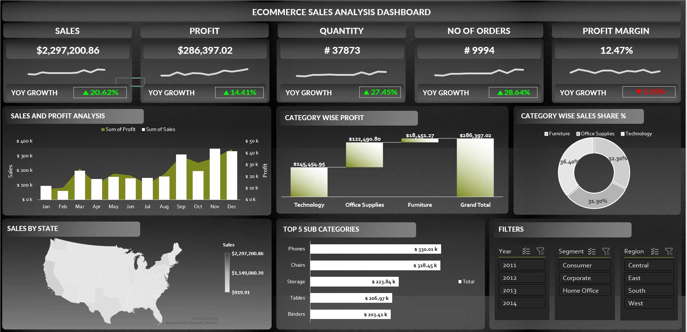

# eCommerce Data Analysis Dashboard

## Overview

This repository contains an eCommerce data analysis dashboard created using Excel. The dashboard provides insights into key performance indicators (KPIs) that track Year-over-Year (YoY) metrics such as profit, profit margin, orders, sales, quantity, and more.

## Steps to Replicate

### 1. Cleaning and Preparing Data

Ensure that your dataset is clean and well-prepared for analysis. Address any missing or inconsistent data to ensure the accuracy of your insights.

### 2. Pivot Tables and Analysis

Utilize Excel's pivot tables to perform in-depth analysis on your eCommerce data. Aggregate and summarize data to extract meaningful information for decision-making.

### 3. Dashboard Creation

Create a comprehensive dashboard that visually represents the key insights derived from the analysis. Include the following KPIs:

- YoY Profit
- Profit Margin
- Orders
- Sales
- Quantity Sold

#### Additional KPIs

Feel free to customize your dashboard with additional KPIs that are relevant to your eCommerce business. This may include customer acquisition cost, conversion rates, or inventory turnover.

## Usage

To use the dashboard:

1. Download or clone the repository.
2. Open the Excel file containing the dashboard.
3. Navigate to the "Dashboard" tab to view the visualizations and KPIs.

## Contributing

If you would like to contribute to this project or have suggestions for improvement, feel free to open an issue or submit a pull request.

Happy analyzing!

